# Aseprite Diagram Generator

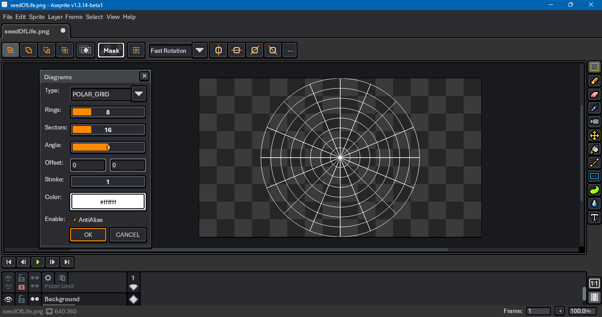

This is a diagram generator for use with the [Aseprite](https://www.aseprite.org/) [scripting API](https://github.com/aseprite/api). At time of writing, it requires Aseprite [beta](https://aseprite.org/beta) to work, available either through Steam or compiled from [Github](https://github.com/aseprite/aseprite/tree/beta). Any version since that supports acquiring a graphics context from an image will work.

## Download

To download this script, click on the green Code button above, then select Download Zip. You can also click on the `genDiagram.lua` file. Beware that some browsers will append a `.txt` file format extension to script files on download. Aseprite will not recognize the script until this is removed and the original `.lua` extension is used. There can also be issues with copying and pasting. Be sure to click on the Raw file button; do not copy the formatted code.

## Usage

To use this script, open Aseprite. In the menu bar, go to `File > Scripts > Open Scripts Folder`. Move the Lua script into the folder that opens. Return to Aseprite; go to `File > Scripts > Rescan Scripts Folder` (the default hotkey is `F5`). The script should now be listed under `File > Scripts`. Select `genDiagram.lua` to launch the dialog.

If an error message in Aseprite's console appears, check if the script folder is on a file path that includes characters beyond ASCII, such as 'é' (e acute) or 'ö' (o umlaut).

A hot key can be assigned to the script by going to `Edit > Keyboard Shortcuts`. The search input box in the top left of the shortcuts dialog can be used to locate the script by its file name. Upon launching the dialog, the OK button will have focus. Holding down the `Alt` key and pressing `O` will create the grid. The dialog can be closed with `Alt+C`.

Diagrams are offset relative to the sprite canvas's center. Most--but not all--diagrams scale with respect to a canvas's short edge.

## Design Intent

Many lines and curves generated by this script are not pixel perfect insofar as their slope does not allow for a uniform rise and run. For example, a rise of 1 over a run of 2 has an arctangent of roughly 26.565 degrees. The tangent of 60 degrees, by contrast, is roughly 1.732. For this reason, this script is not designed to draw shapes for you, only guidelines. That is why the script only draws strokes, not fills, and why it defaults to anti-aliased lines. For further discussion of these concepts, refer to Youtube videos like [Constructing Lines and Curves in Pixel Art](https://www.youtube.com/watch?v=ye21r27kN9I) by Brandon James Greer.

## Acknowledgments

Many diagrams were influenced by [Zak Korvin](https://www.youtube.com/@ZKorvin)'s geometry drawing videos: [Radiating Circles](https://www.youtube.com/watch?v=zULrMqzxZ1I), [Sand Reckoner's diagram](https://www.youtube.com/watch?v=4cG9RahEpvM), [Try This Grid on Your Next Mandala](https://www.youtube.com/watch?v=vF1Y1avXjF8), [Drawing the Pentagram](https://www.youtube.com/watch?v=BYz08m1HfVw), [Mobius Egg](https://www.youtube.com/watch?v=pQt-wtjOH-E).

## Examples

The script supports the creation of the following diagrams:

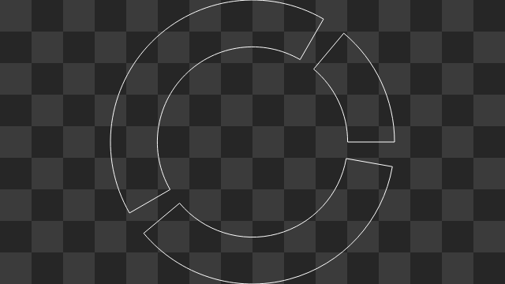

Arcs

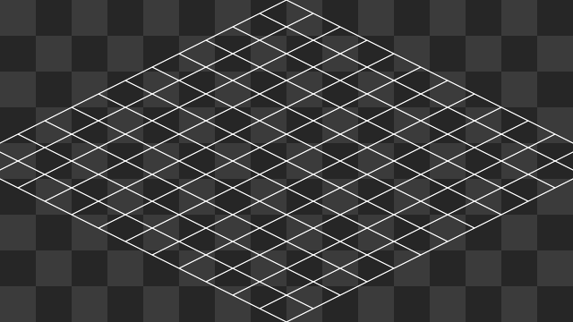

Dimetric Grid

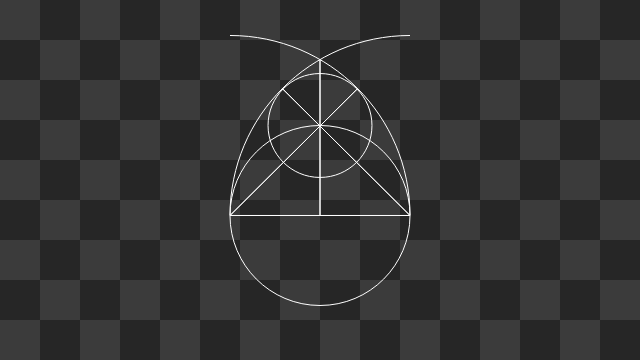

Egg

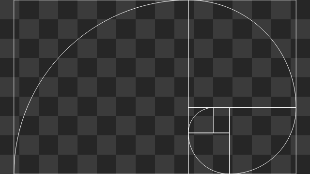

Golden Rectangle

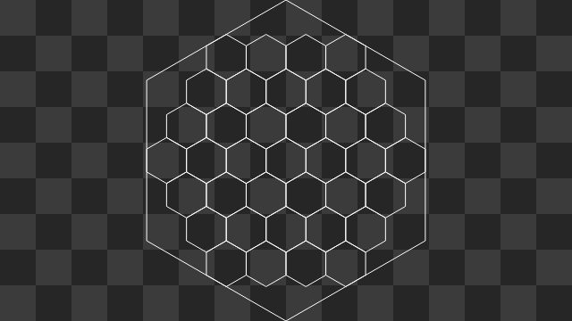

Hexagon Grid

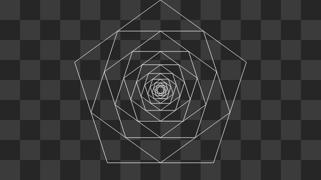

Inscribed Polygon

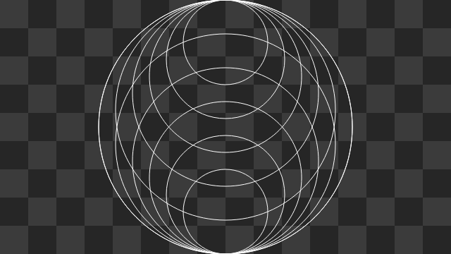

Nested Circles

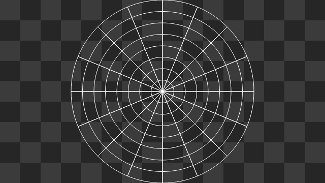

Polar Grid

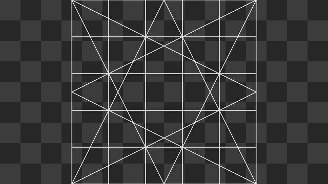

Sand Reckoner

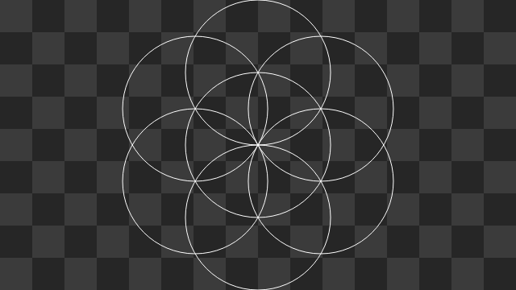

Seed of Life

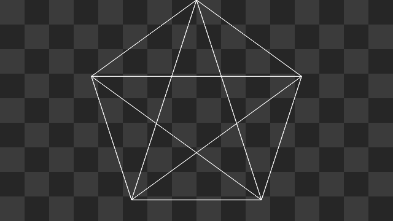

Star

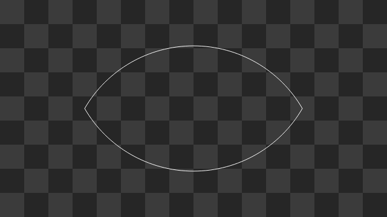

Vesica Piscis

🇹🇼 🇺🇦